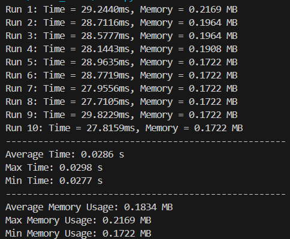

# Integrantes Grupo 1: TP 1 Inteligencia Artificial
- Christopher Sebastian,	Charaf Herrera
- Cecilia Azul,	Villanueva
- Maria Fabiana,	Cid
- Pedro Idelfonso,	Fernandez Ruiz
- Santiago Jose,	Olaciregui
- Gustavo Julián,	Rivas

# Análisis del Problema de la Torre de Hanoi

## 1. PEAS (Performance, Environment, Actuators, Sensors)

- **Performance (Rendimiento)**: Número de acciones para llegar al estado final (goal), tiempo de ejecución hasta su solución, y qué tan óptimo es el procedimiento.
- **Environment (Entorno)**: Tabla con tres palos y cinco discos, con reglas sobre cómo mover los discos; solo se puede mover un disco a la vez, y un disco más grande no puede colocarse sobre otro más pequeño.
- **Actuators (Actuadores)**: Mecanismos o formas para mover los discos entre los palos.
- **Sensors (Sensores)**: Interfaz de retroalimentación para detectar el orden y la posición de los discos en los palos.

## 2. Propiedades del Entorno

- **Determinista**: El resultado de mover los discos es predecible para el agente.
- **Discreto**: El número de discos y palos es contable por el agente.
- **Estático**: El entorno no cambia mientras se resuelve (no ocurren cambios a menos que se realice una acción por el agente).
- **Episódico**: La acción de mover un disco es un episodio separado, ya que las acciones anteriores no dependen de la misma.
- **Totalmente Observable**: Todo el estado del juego es siempre visible; el entorno es completamente observable.
- **Agente Individual**: Solo hay un agente actuando en el entorno, haciendo que sea un problema de agente individual.

## 3. Definiciones en el Contexto de Este Problema

- **Estado**: Configuración u orden de los discos en los palos.
- **Espacio de Estados (grafo)**: Todas las configuraciones posibles de los discos en los palos.
- **Árbol de Búsqueda**: Un árbol que representa la secuencia de movimientos comenzando desde el estado inicial de la Torre de Hanoi.
- **Nodo de Búsqueda**: Una representación de un estado en el árbol de búsqueda producto de una acción.
- **Objetivo**: Mover todos los discos del palo inicial al palo objetivo sin realizar movimientos ilegales o imposibles.
- **Acción**: Mover un disco de un palo a otro.
- **Frontera**: El conjunto de todos los nodos que se están expandiendo, esperando ser explorados.

## 4. Implementar un Método de Búsqueda

Se usará el algoritmo A* con una cola prioritaria y una heurística simple que cuenta el número de discos que no están en la posición objetivo. Esta heurística también garantiza que nunca se sobreestima el número de movimientos restantes. La fórmula de costo para este algoritmo es \(f(n) = g(n) + h(n)\) donde:
- \(g(n)\): Costo del camino desde el nodo inicial hasta n.
- \(h(n)\): Es la heurística que estima el costo de ir desde n hasta el nodo objetivo.

## 5. Complejidad en Tiempo y Memoria del Algoritmo Elegido

- **Complejidad en Tiempo**: La complejidad en tiempo del algoritmo A* depende de la heurística seleccionada, el factor de ramificación \(b\), y la profundidad de la solución más corta \(d\), resultando así en la expresión: \(O(b^d)\).
  - Tiempo promedio observado: 28.40690000448376 ms

- **Complejidad en Memoria**: Se define de la misma manera \(O(b^d)\).
  - Máxima memoria ocupada observada: 0.22 MB

En conclusión, el desvío estándar de estas mediciones de tiempo es 0.64 ms y 0.0151 MB para la memoria.

## 6. Especificaciones de Implementación en Cuanto a Tiempo y Memoria

En conclusión, el desvío estándar de estas mediciones de tiempo es 0.64ms y 0.0151 MB para la memoria.

## 7. Optimalidad de la Solución

- **Resultado esperado de optimalidad**: Dado que el número óptimo de movimientos para el problema de la Torre de Hanoi con \( k \) discos es \( 2^k - 1 \), y teniendo en cuenta lo mencionado en el punto 4:
  - \( k = 5 \) discos deberían resultar en \( 2^5 - 1 = 31 \) movimientos.
- **Resultado de 10 iteraciones del algoritmo A***:
  - Consistentemente 31 movimientos.
- En conclusión, podemos determinar que el algoritmo y la heurística utilizados son óptimos con respecto a la norma.
